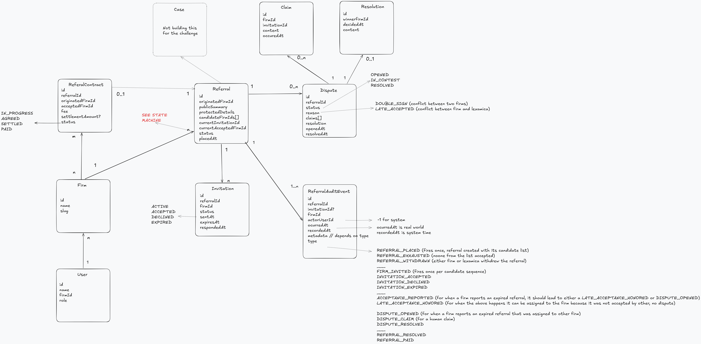
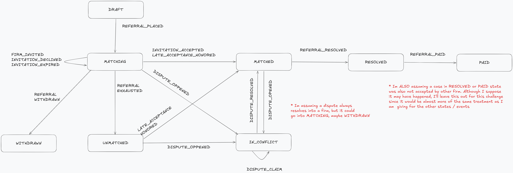

# Lexamica — Referral Invitation Lifecycle

This README walks through my reasoning and design. The two hand-drawn diagrams (domain model + state machine) are the whiteboard I actually worked from — I left the notes-to-self (in red) in, since they show what I deliberately scoped out and why.

---

## Run it

Everything is orchestrated from the **root `package.json`** (via `concurrently`), so it all runs from the parent folder:

```bash
# 0. Mongo as a single-node replica set (multi-doc transactions need it)
docker compose up -d      # or: npm run docker:up — self-initializes rs0 via a healthcheck

# 1. Install root + api + web
npm run install:all

# 2. Copy the env templates to their real .env files
cp api/.env.example api/.env && cp web/.env.example web/.env

# 3. Seed the demo data, then start API (:4000) and web (:3000) together
npm run seed
npm run dev


# Optional, run back and front sepparated via npm run dev in each subfolder if you want too, I've added the following aliases in case you want to.
npm run dev:api
npm run dev:web
```

## Seed

Three firms you can log in as (password `password`).
They're the **candidates**, and they are always invited in this order (A → B → C):

- **A — Avery & Associates** — `alice@lexamica.com`
- **B — Brennan Injury Law** — `bob@lexamica.com`
- **C — Carter Legal Group** — `carol@lexamica.com`

Every seeded case is placed by **Hollis Law** (the originating firm) and offered A → B → C, one at a time.

One case is dropped **mid-sequence** — Avery's invite already expired, Brennan's is live — so you can test a conflict right away.

NOTE FOR THE REVIEWER: Use the **firm switcher** (top bar) to watch the same case from each side, and the **`?` demo controls** on a case to force-expire an invite or resolve a dispute (the two things the platform can't do on its own). So you don't need to use postman or call endpoints manually to fake time passage.

---

## 1. Domain model



The **Referral is the main entity** — it gets created with the sequence, I am assuming that it doesnt changes for this callenge, altough in a real world scenario it could change at any point, it is just an array inside the entity.
The state of the Referral is a state machine (_see next section of the document_), and its events are the audit events that you see in the diagram.
A referral also can enter in a dispute, as stated in the diagram, via either a double sign or a late acceptance. These disputes either get automatically resolved or need manual resolution. That is included in this challenge.

---

## 2. Lifecycle & state machine



The referral is a state machine, and the **audit-event types are the transitions**.
It lives in one file — [`referral.state-machine.ts`](api/src/referrals/referral.state-machine.ts) — as a typed table, so the whole lifecycle is readable in one place.

Happy path: `DRAFT → MATCHING → MATCHED`.

The interesting edges come from reality:

- A firm declines, or its invite expires → **advance to the next firm**.
- Nobody accepts → **UNMATCHED** (still revivable by a late report).
- A firm accepts, or a safe late report → **MATCHED**.
- Two firms, one client → **IN_CONFLICT** — a dispute; automation stops.
- Adjudicator picks a winner → back to **MATCHED**.

All transitions are guarded with the query filter as the lock, so multiple instances of backend cannot trigger a state change at the same time.

## 3. Auto resolving and Human escalation

When a firm tells us it signed the client on its own (off-platform), we are auto resolving if possible, if not, escalating to humans:

- **If no one has the case → give it to them.** They actually have the client, so the case is theirs. If another firm still had a pending invite, that invite is closed out. No human needed.
- **Another firm already holds it → stop and flag it.** Now two firms claim the same client — a serious conflict — so we never decide it automatically. We freeze the case and hand it to a person.

---

## 4. Confidentiality — decided on the backend

All of this lives in one file — [`referrals-read.service.ts`](api/src/referrals/referrals-read.service.ts).
It's the **read model**: the single place that builds what a firm actually sees. Every privacy rule of the challenge is enforced here: who gets the client's details, whose statements you see, and hiding who took a case.

---

## 5. Architecture

Both repos are organized by domain. The folders that matter:

**`api/` (NestJS)** — one module per entity, persistence behind repositories:

- `referrals/` — the aggregate: state machine, read model, controller, repositories, and the state-machine table
- `invitations/` — the Invitation entity: schema + repository
- `disputes/` — the Dispute entity: schema + repository
- `auth/`, `users/`, `firms/` — identity + login

**`web/` (Next.js)** — SSR pages, a per-domain data layer, feature-grouped components:

- `app/` — routes: SSR pages + the auth-gated layout
- `domain/` — the data layer: `invitation/` and `dispute/` (queries, hooks, logic, types)
- `components/` — `ui/` (the kit), `layout/`, `common/`, `invitations/`, `disputes/`

---

## 6. What I would add if I had more time

**Product level:** a real expiry scheduler; the ops/adjudicator console; a client-identity conflict-check; the originating firm flow where they can upload their cases and define the contracts; contract disputing; payments flow.
**Technical level**: websockets/SSE instead of polling; codegen types from the backend directly; I would revise the need of a relational database for this type of problem.

##7. Final words
I've cut some corners to fit a 6 hours challenge time also, I could've spent more and more time with this but I suppose it wouldn't be fair with other applicants if I'd spent a lot more hours, my idea is also to show which corners I've cut so you guys have a real impression of my work and my thinking.
Overall I've dedicated aproximatelly 7 hours to this, started by creating the ERD diagram, then the state machine, went back and forth with it, when I had a hood clear undestanding of the project I've created a backend and frontend folder structure and then built using claude and codex. After that iterated the code and cleaned up and polished for and hour and a half and then manual touch of code for another 2 hours or so...

I hope you like it, hope it fits what you are looking for. In any case, I felt it as a really well made challenge, deep enough to dedicate a good reasoning to it and had fun going through it.

Thanks!

-Jason.
